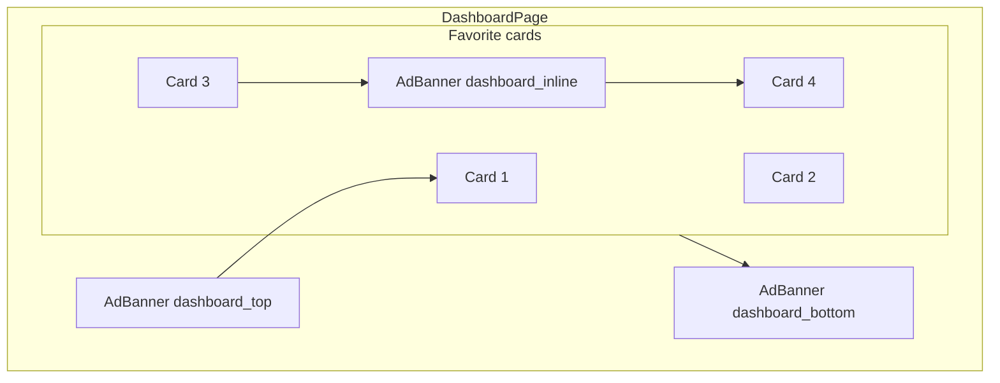

# Advertisements

Phase 5 deliverable. Self-hosted ad slots injected into the dashboard with impression tracking. Designed for future third-party network support (e.g. Google AdSense) without changing the slot API.

## Placements

| Placement | Location | Behavior |
|-----------|----------|----------|
| `dashboard_top` | Above all favorite cards | Full-width banner |
| `dashboard_inline` | Between favorite card rows | Inserted after every 3 cards |
| `dashboard_bottom` | Below all favorite cards | Full-width banner |



## Data model

Table: `ad_slots`

| Column | Type | Description |
|--------|------|-------------|
| `id` | UUID | Primary key |
| `placement` | VARCHAR | One of the three placements above |
| `title` | VARCHAR | Alt text / admin label |
| `image_url` | VARCHAR | Banner image URL |
| `target_url` | VARCHAR | Click-through destination |
| `priority` | INT | Higher value wins when multiple ads are active |
| `start_at` | TIMESTAMPTZ | Campaign start (inclusive) |
| `end_at` | TIMESTAMPTZ | Campaign end (inclusive) |
| `active` | BOOLEAN | Manual enable/disable override |
| `impression_count` | BIGINT | Total impressions recorded |

### Active ad selection

An ad is **active** when:

```
active = true
AND now() >= start_at
AND now() <= end_at
```

`GET /ads/active?placement=...` returns matching ads ordered by `priority DESC`.

## API

### Public

#### `GET /ads/active?placement={placement}`

Returns active ads for the requested placement. No authentication required.

```json
[
  {
    "id": "550e8400-e29b-41d4-a716-446655440000",
    "placement": "dashboard_top",
    "title": "Summer promo",
    "imageUrl": "/static/ads/summer.png",
    "targetUrl": "https://example.com/promo"
  }
]
```

#### `POST /ads/{id}/impression`

Records one impression. Fire-and-forget on the server (`Uni` chain, non-blocking).

- No authentication
- Rate-limited by client IP (prevent abuse)
- Response: `204 No Content`
- Not on the critical request path — failures are silently dropped

### Admin (Firebase custom claim `admin: true`)

| Method | Path | Description |
|--------|------|-------------|
| `POST` | `/admin/ads` | Create ad slot |
| `PUT` | `/admin/ads/{id}` | Update ad slot |
| `DELETE` | `/admin/ads/{id}` | Delete ad slot |

**Create request example:**

```json
{
  "placement": "dashboard_top",
  "title": "Summer promo",
  "imageUrl": "/static/ads/summer.png",
  "targetUrl": "https://example.com/promo",
  "priority": 10,
  "startAt": "2026-06-01T00:00:00+08:00",
  "endAt": "2026-08-31T23:59:59+08:00",
  "active": true
}
```

## Frontend: `AdBanner` component

```tsx
// Pseudocode
function AdBanner({ placement }: { placement: string }) {
  const { data: ads } = useQuery(['ads', placement], () => fetchActiveAds(placement));
  const ref = useRef<HTMLAnchorElement>(null);

  useEffect(() => {
    const observer = new IntersectionObserver(([entry]) => {
      if (entry.isIntersecting) {
        recordImpression(ad.id);  // fire-and-forget POST
        observer.disconnect();
      }
    });
    if (ref.current) observer.observe(ref.current);
    return () => observer.disconnect();
  }, [ad]);

  return (
    <a ref={ref} href={ad.targetUrl} target="_blank" rel="noopener">
      
    </a>
  );
}
```

Impressions are counted once per page view when the ad enters the viewport (Intersection Observer).

## Dev assets

Placeholder images for local development:

```
src/main/resources/META-INF/resources/ads/
├── placeholder-top.png
├── placeholder-inline.png
└── placeholder-bottom.png
```

Seeded via Flyway `V3__dev_ads.sql` (dev profile only).

## Future: third-party ad networks

Extend the model without breaking the slot API:

```json
{
  "adType": "SELF_HOSTED",
  "imageUrl": "...",
  "targetUrl": "..."
}
```

```json
{
  "adType": "THIRD_PARTY",
  "embedCode": "<script>...</script>"
}
```

`AdBanner` renders either an image link or injected embed code based on `adType`. The `GET /ads/active` response shape gains optional `adType` and `embedCode` fields.

## Risks

| Risk | Mitigation |
|------|------------|
| Impression inflation | IP rate limiting; count once per viewport entry per page load |
| Slow impression writes | Fire-and-forget `Uni`; not awaited by dashboard ETA fetch |
| Inappropriate ads | Admin-only CRUD; manual review before `active = true` |
