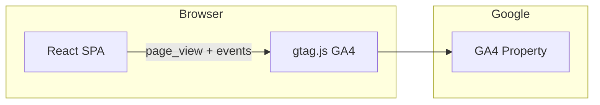

# Google Analytics (GA4)

PT Dashboard uses **Google Analytics 4 (GA4)** for product usage analytics on the React frontend. Analytics are separate from ad impression tracking (Phase 5) and subscription billing (Phase 7).

## Goals

| Goal | How GA4 helps |
|------|----------------|
| Understand traffic | Page views, sessions, DAU/MAU |
| Funnel conversion | Sign-up → add favorite → upgrade to Pro |
| Feature usage | Which transport types users save most |
| Performance | Engagement time on dashboard |

## Architecture



- **Client-only** — GA4 via `gtag.js` loaded in the SPA; no server-side Measurement Protocol in initial scope
- **No PII** — never send email, Firebase UID, or favorite stop IDs to GA4
- **Opt-in consent** — analytics loads only after user accepts cookie/analytics banner (HK PDPO-friendly)

## Configuration

| Variable | Where | Example |
|----------|-------|---------|
| `GA_MEASUREMENT_ID` | Build-time / Qute-injected | `G-XXXXXXXXXX` |
| `GA_ENABLED` | `application.properties` (prod profile) | `true` |
| `GA_DEBUG` | Dev profile | `false` (use GA DebugView only when testing) |

Inject into `index.html` or `web/analytics.ts` via Quarkus Web Bundler / Qute template — **do not hardcode** measurement ID in source.

```html
<!-- Loaded only when GA_ENABLED and user consented -->
<script async src="https://www.googletagmanager.com/gtag/js?id=G-XXXXXXXXXX"></script>
```

## Implementation (`web/analytics.ts`)

```typescript
declare global {
  interface Window { gtag?: (...args: unknown[]) => void; }
}

export function initAnalytics(measurementId: string) {
  if (!measurementId || !hasAnalyticsConsent()) return;
  // standard gtag bootstrap
}

export function trackPageView(path: string) {
  window.gtag?.('event', 'page_view', { page_path: path });
}

export function trackEvent(name: string, params?: Record<string, string | number>) {
  window.gtag?.('event', name, params);
}
```

Call `trackPageView` on React Router navigation. Wrap `trackEvent` for key actions.

## Events (custom)

| Event | Trigger | Parameters |
|-------|---------|------------|
| `page_view` | Route change | `page_path`, `page_title` |
| `sign_up` | Firebase registration success | `method` (email, google) |
| `login` | Firebase sign-in success | `method` |
| `add_favorite` | Favorite saved | `transport_type` (KMB, MTR, LRT, …) — **no stop/route IDs** |
| `delete_favorite` | Favorite removed | `transport_type` |
| `refresh_eta` | Manual dashboard refresh | — |
| `upgrade_click` | User taps Pro CTA | `source` (limit_reached, settings, banner) |
| `subscription_started` | Stripe checkout completed | `plan` (pro_monthly) |
| `ad_impression` | Optional mirror of ad slot view | `placement` — or keep ads on internal counter only |

Use [GA4 recommended event names](https://support.google.com/analytics/answer/9267735) where applicable (`sign_up`, `login`).

## Cookie consent

Display a consent banner on first visit (Phase 6):

- **Accept** — load GA4, persist choice in `localStorage` (`analytics_consent=granted`)
- **Decline** — no GA scripts loaded
- Link to privacy policy (future) explaining analytics and Firebase auth cookies

Analytics module checks `hasAnalyticsConsent()` before any `gtag` call.

## Environments

| Environment | GA4 behavior |
|-------------|--------------|
| Local dev | Disabled by default (`GA_ENABLED=false`) |
| Staging | Separate GA4 property or debug mode |
| Production | Live property; consent required |

## Privacy

- Do not enable Google signals / ads personalization without explicit product decision
- Do not send personally identifiable or precise location data
- Firebase Auth cookies are separate from GA; document both in privacy policy
- Pro users are tracked at aggregate level only (no tier in user-id scope)

## References

- [GA4 gtag.js setup](https://developers.google.com/analytics/devguides/collection/ga4)
- [GA4 event reference](https://developers.google.com/analytics/devguides/collection/ga4/reference/events)
- Dataset unrelated — this is first-party product analytics, not government open data
