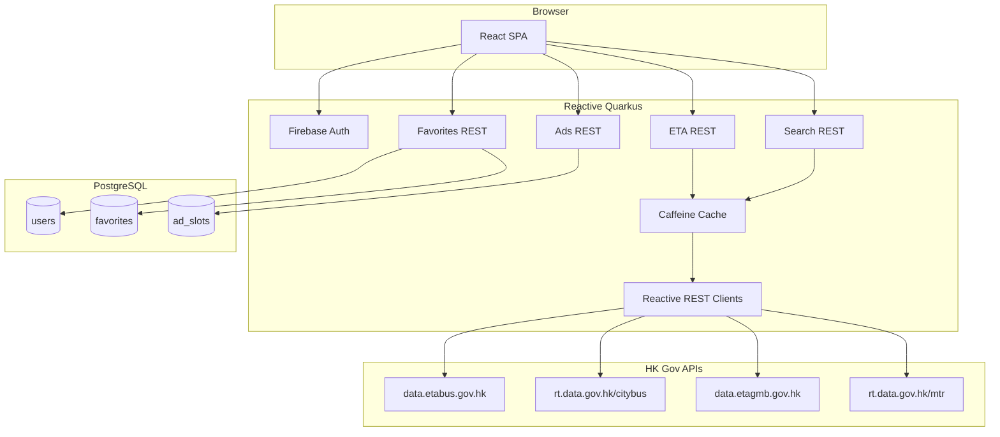

# Architecture

## Overview

PT Dashboard is a full-stack web application. The browser runs a React SPA; a reactive Quarkus backend proxies Hong Kong government ETA APIs, manages user accounts and favorites in PostgreSQL, and serves advertisement slots.



## Why proxy through the backend

| Concern | Backend proxy benefit |
|---------|----------------------|
| CORS | Government APIs are not callable directly from the browser |
| Rate limits | MTR and batch APIs return HTTP 429; centralized cache and deduplication |
| Cache efficiency | Per-route cache keys shared across users with the same favorite |
| Security | Firebase ID token verification; app user data stays server-side |

## Reactive stack

The backend is **fully reactive** — no blocking JDBC or `.await().indefinitely()` on the request path.

| Component | Technology |
|-----------|------------|
| REST layer | RESTEasy Reactive — resources return `Uni<T>` / `Multi<T>` |
| Persistence | Hibernate Reactive + Panache (`hibernate-reactive-panache`) |
| DB driver | `reactive-pg-client` (Vert.x PostgreSQL client) |
| HTTP clients | REST Client Reactive (`rest-client-reactive-jackson`) |
| Concurrency | `Uni.combine().all()` for parallel ETA fetches |
| Migrations | Flyway (blocking JDBC at startup only — standard Quarkus pattern) |
| Cache | Quarkus Caffeine |

### Reactive conventions

- Panache reactive APIs (`find`, `persist`, `delete`) return `Uni`
- All upstream HTTP calls return `Uni`
- Security identity propagated via Vert.x context in reactive chains
- Wrap blocking Firebase Admin SDK calls (`verifyIdToken`) on worker pool
- Impression tracking and other non-critical writes use fire-and-forget `Uni`

## Caching

| Cache name | TTL | Key pattern | Purpose |
|------------|-----|-------------|---------|
| `bus-eta` | 60s | `(operator, stopId, route)` | Per-route bus/minibus ETA |
| `mtr-eta` | 10s | `(line, station)` | MTR next-train schedule |
| `stop-search` | 24h | `(type, query)` | Static stop/route metadata |

Cache keys deduplicate upstream calls when multiple users share the same favorite configuration.

## Polling policy

| Source | Upstream refresh rate | Client auto-refresh |
|--------|----------------------|---------------------|
| Bus / GMB | ~60s | 60s when tab visible |
| MTR | ~10s | 60s (backend cache at 10s) |

Refresh triggers: dashboard load, manual refresh button, React Query `refetchInterval`.

On upstream 429/5xx: return `status: "error"`; show last cached result with a stale badge when available.

## Project layout

```
pt_dashboard/
├── docker-compose.yml
├── pom.xml
├── docs/                          # This documentation
├── src/main/
│   ├── java/com/faworkshop/ptdashboard/
│   │   ├── auth/                  # FirebaseAuthFilter, AuthResource, FirebaseIdentityProvider
│   │   ├── entity/                # User, Favorite, AdSlot
│   │   ├── resource/              # Reactive REST endpoints
│   │   ├── service/               # EtaService, FavoriteService, SearchService, AdService
│   │   ├── service/client/        # KmbClient, CitybusClient, GmbClient, MtrClient, NlbClient
│   │   └── dto/                   # Normalized ETA and Ad DTOs
│   ├── resources/
│   │   ├── application.properties
│   │   ├── db/migration/          # Flyway SQL
│   │   └── web/                   # React SPA (Quarkus Web Bundler)
│   └── test/java/                 # EtaNormalizer unit tests
└── README.md
```

## Quarkus extensions

```
rest-jackson
hibernate-reactive-panache
reactive-pg-client
flyway
security
caffeine
rest-client-reactive-jackson
com.google.firebase:firebase-admin
io.quarkiverse.web-bundler:quarkus-web-bundler
```

See [Authentication](auth.md) for Firebase setup and token flow.
