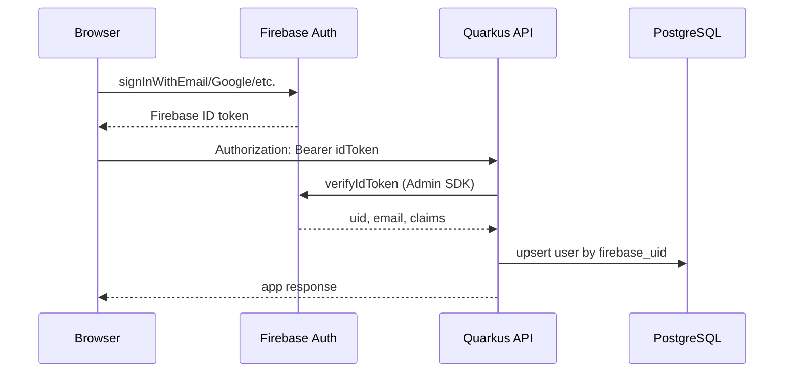

# Authentication — Firebase

PT Dashboard uses **Firebase Authentication** for identity. The backend does not store passwords or issue its own JWTs — it verifies Firebase ID tokens and links users to app data in PostgreSQL.

## Flow



## Responsibilities

| Layer | Responsibility |
|-------|----------------|
| **Firebase (client)** | Sign-in UI, session persistence, token refresh |
| **Firebase Admin SDK (server)** | Verify ID tokens, read custom claims |
| **PostgreSQL** | App user profile, favorites (linked by `firebase_uid`) |

## Supported sign-in methods (Phase 1)

| Provider | Firebase method | Notes |
|----------|-----------------|-------|
| Email/password | `signInWithEmailAndPassword` / `createUserWithEmailAndPassword` | Primary |
| Google | `signInWithPopup(GoogleAuthProvider)` | Optional in Phase 1 |
| Apple | `signInWithPopup(OAuthProvider)` | Phase 6 stretch |

Password reset, email verification, and MFA are delegated to Firebase — not implemented in the Quarkus backend.

## User provisioning

On the first authenticated request (or explicit `POST /auth/sync`):

1. Verify Firebase ID token
2. Look up `users` by `firebase_uid`
3. If missing, insert row with `firebase_uid`, `email`, `display_name` from token claims
4. If exists, optionally update `email` / `display_name` if changed in Firebase

No `POST /auth/register` or `POST /auth/login` on the backend — registration and login happen in Firebase on the client.

## Admin role

Admin access for `/admin/ads` uses **Firebase custom claims**:

```json
{ "admin": true }
```

Set via Firebase Admin SDK (script or Firebase console custom claims). The backend checks `decodedToken.getClaims().get("admin")` and maps to Quarkus `@RolesAllowed("admin")`.

## Backend implementation

### Dependencies

```xml
<dependency>
  <groupId>com.google.firebase</groupId>
  <artifactId>firebase-admin</artifactId>
</dependency>
<dependency>
  <groupId>io.quarkus</groupId>
  <artifactId>quarkus-security</artifactId>
</dependency>
```

### Configuration (`application.properties`)

```properties
# Path to service account JSON or use GOOGLE_APPLICATION_CREDENTIALS env var
firebase.service-account-path=${FIREBASE_SERVICE_ACCOUNT_PATH:}
firebase.project-id=${FIREBASE_PROJECT_ID}
```

Service account JSON is required for Firebase Admin SDK. **Never commit** credentials — use env vars or secrets manager in production.

### Token verification (reactive)

`FirebaseAuth.verifyIdToken()` is blocking. Wrap on a worker thread:

```java
Uni.createFrom().item(() -> FirebaseAuth.getInstance().verifyIdToken(token))
    .runSubscriptionOn(Infrastructure.getDefaultWorkerPool());
```

### Security components

| Class | Purpose |
|-------|---------|
| `FirebaseAuthFilter` | Extract `Bearer` token, verify, set `SecurityIdentity` |
| `FirebaseIdentityProvider` | Map Firebase uid → app `User` entity |
| `AuthResource` | `GET /auth/me`, `POST /auth/sync` |

## Frontend implementation

### Dependencies (mvnpm)

```
firebase
```

### Config (`web/firebase.ts`)

Firebase web config from environment (injected at build or via `application.properties` → Qute template):

```typescript
const firebaseConfig = {
  apiKey: "...",
  authDomain: "...",
  projectId: "...",
  // ...
};
export const auth = getAuth(initializeApp(firebaseConfig));
```

### Client API wrapper

```typescript
async function apiFetch(path: string, options?: RequestInit) {
  const user = auth.currentUser;
  const token = user ? await user.getIdToken() : null;
  return fetch(`/api/v1${path}`, {
    ...options,
    headers: {
      ...options?.headers,
      ...(token && { Authorization: `Bearer ${token}` }),
    },
  });
}
```

Firebase SDK handles token refresh automatically; call `getIdToken()` before each API request (or on 401 retry).

### Auth state

`onAuthStateChanged` drives route guards:

- Signed out → redirect to `/login`
- Signed in → call `POST /auth/sync`, then load dashboard

## Environment variables

| Variable | Where | Purpose |
|----------|-------|---------|
| `FIREBASE_PROJECT_ID` | Backend | Firebase project |
| `FIREBASE_SERVICE_ACCOUNT_PATH` | Backend | Service account JSON path |
| `VITE_FIREBASE_*` or Qute-injected | Frontend | Firebase web SDK config |

## Local development

1. Create a Firebase project at [console.firebase.google.com](https://console.firebase.google.com)
2. Enable Email/Password (and Google if desired) under Authentication → Sign-in method
3. Download service account key → set `FIREBASE_SERVICE_ACCOUNT_PATH`
4. Add web app in Firebase console → copy config into frontend env
5. For emulator (optional): Firebase Auth Emulator on `:9099` for offline dev

## Security notes

- ID tokens expire after ~1 hour; client must refresh via Firebase SDK
- Verify tokens on **every** protected request — do not trust client-sent `uid`
- Rate-limit `POST /auth/sync` to prevent abuse
- CORS: allow frontend origin only
