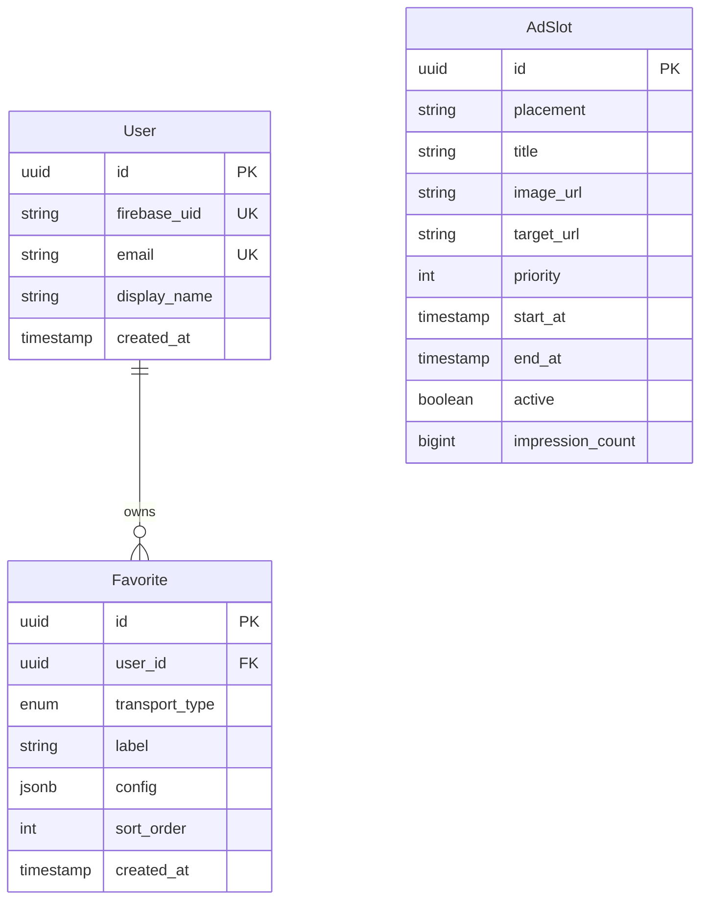

# Data Model

## Entity relationship



## Users

| Column | Type | Notes |
|--------|------|-------|
| `id` | UUID | Primary key (app-internal) |
| `firebase_uid` | VARCHAR | Unique; Firebase Auth UID |
| `email` | VARCHAR | Synced from Firebase token claims |
| `display_name` | VARCHAR | Synced from Firebase profile |
| `created_at` | TIMESTAMPTZ | First sync time |

Passwords are **not stored** — authentication is delegated to Firebase.

Admin users have Firebase custom claim `{ "admin": true }` for `/admin/ads` endpoints. See [Authentication](auth.md).

## Favorites

Each favorite belongs to one user. `transport_type` is one of: `KMB`, `CTB`, `NLB`, `GMB`, `MTR`, `LRT`, `MTR_BUS`.

| Column | Type | Notes |
|--------|------|-------|
| `id` | UUID | Primary key |
| `user_id` | UUID | FK → users |
| `transport_type` | ENUM | Operator type |
| `label` | VARCHAR | User-facing name; defaults to `"{route} @ {stopName}"` |
| `config` | JSONB | Polymorphic per transport type (see below) |
| `sort_order` | INT | Dashboard card order |
| `created_at` | TIMESTAMPTZ | Creation time |

### Unique constraint

```
UNIQUE (user_id, transport_type, stop_id, route_key)
```

- `stop_id` extracted from `config.stopId`, `config.busStopId`, `config.station` (MTR), or `config.stationId` (LRT)
- `route_key` is `config.route`, `config.routeId`, `config.routeNo`, or `config.routeName` depending on type
- Prevents duplicate stop+route pairs per user
- Same physical stop may appear multiple times with **different routes**

### Config schemas

**Route is required** for all bus, minibus, and Light Rail types.

#### KMB

```json
{
  "stopId": "0B150F9A4BFF8F5F",
  "route": "720",
  "serviceType": "1",
  "direction": "O"
}
```

| Field | Required | Description |
|-------|----------|-------------|
| `stopId` | Yes | KMB stop ID |
| `route` | Yes | Route number (e.g. `"720"`) |
| `serviceType` | Yes | KMB service type (usually `"1"`) |
| `direction` | No | `I` (inbound) or `O` (outbound) |

#### Citybus (CTB)

```json
{
  "stopId": "001313",
  "route": "720",
  "direction": "O"
}
```

| Field | Required | Description |
|-------|----------|-------------|
| `stopId` | Yes | 6-digit Citybus stop ID |
| `route` | Yes | Route number |
| `direction` | No | `I` or `O` |

#### NLB

```json
{
  "stopId": "1234",
  "routeId": 42
}
```

| Field | Required | Description |
|-------|----------|-------------|
| `stopId` | Yes | NLB stop ID |
| `routeId` | Yes | NLB numeric route ID |

#### Green minibus (GMB)

```json
{
  "stopId": "20003337",
  "routeId": 2003241,
  "routeSeq": 1
}
```

| Field | Required | Description |
|-------|----------|-------------|
| `stopId` | Yes | GMB stop ID |
| `routeId` | Yes | GMB route ID |
| `routeSeq` | No | Direction sequence on route |

#### MTR

```json
{
  "line": "TWL",
  "station": "ADM",
  "direction": "UP",
  "platform": "1"
}
```

| Field | Required | Description |
|-------|----------|-------------|
| `line` | Yes | Line code: `AEL`, `TCL`, `TML`, `TKL`, `EAL`, `SIL`, `TWL`, `ISL`, `KTL`, `DRL` |
| `station` | Yes | 3-letter station code (e.g. `ADM`, `CEN`, `TKO`) |
| `direction` | No | `UP` or `DOWN` — filters displayed trains |
| `platform` | No | Platform number — filters displayed trains |

MTR heavy rail favorites do **not** have a `route` field. Platform numbers are dynamic and come from live ETA responses.

#### Light Rail (LRT)

```json
{
  "stationId": 600,
  "routeNo": "614",
  "platformId": 1,
  "withSpecial": 1
}
```

| Field | Required | Description |
|-------|----------|-------------|
| `stationId` | Yes | Numeric LRT station ID (e.g. `600` = Yuen Long) |
| `routeNo` | Yes | Route number (e.g. `"614"`, `"751"`); for special routes use value from `additionalInfo1` when `special=1` |
| `platformId` | No | Filter to a specific platform at the station |
| `withSpecial` | No | `0` or `1` — passed to upstream API; default `0` |

LRT favorites require **station + route**, consistent with bus/GMB.

#### MTR Bus

```json
{
  "routeName": "K65",
  "busStopId": "K65-U010",
  "language": "en"
}
```

| Field | Required | Description |
|-------|----------|-------------|
| `routeName` | Yes | Full MTR Bus route variant (e.g. `K65`, `K66 Tai Tong Wong Nai Tun Tsuen to On Hong Road`) — direction encoded in name when variants exist |
| `busStopId` | Yes | Stop ID on the route (from `busStop[].busStopId`) |
| `language` | No | `en` or `zh`; default `en` |

MTR Bus favorites require **stop + route**, consistent with franchised bus. Multiple favorites at the same stop with different routes are allowed.

## Ad slots

See [Advertisements](ads.md) for full details.

| Column | Type | Notes |
|--------|------|-------|
| `id` | UUID | Primary key |
| `placement` | VARCHAR | `dashboard_top`, `dashboard_inline`, `dashboard_bottom` |
| `title` | VARCHAR | Admin label / alt text |
| `image_url` | VARCHAR | Banner image URL |
| `target_url` | VARCHAR | Click-through URL |
| `priority` | INT | Higher = shown first |
| `start_at` | TIMESTAMPTZ | Campaign start |
| `end_at` | TIMESTAMPTZ | Campaign end |
| `active` | BOOLEAN | Manual enable/disable |
| `impression_count` | BIGINT | Incremented by impression endpoint |

## Validation rules (`FavoriteService`)

1. `POST /favorites` rejects bus/GMB/LRT/MTR_BUS payloads missing route or stop fields
2. `PUT /favorites/{id}` allows updating `label` and `sort_order` only — stop and route are immutable (delete and re-add to change)
3. MTR favorites require `line` and `station`
