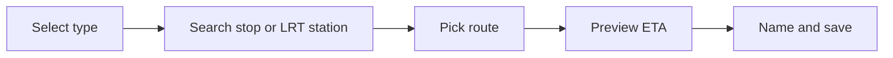

# Frontend

The frontend is a React + TypeScript SPA bundled via [Quarkus Web Bundler](https://quarkus.io/guides/web). Source lives in `src/main/resources/web/`.

## Tech

| Tool | Purpose |
|------|---------|
| React + TypeScript | UI components |
| Tailwind CSS 4 | Styling (Web Bundler built-in support) |
| React Query (mvnpm) | Server state, auto-refresh for `/eta/favorites` |
| Firebase JS SDK (mvnpm) | Authentication, ID token management |
| Quarkus Web Bundler | Zero-config bundling, no separate Node.js install |

## Pages

| Route | Component | Purpose |
|-------|-----------|---------|
| `/login` | `LoginPage` | Firebase email/password + Google sign-in |
| `/register` | `RegisterPage` | Firebase `createUserWithEmailAndPassword` |
| `/` | `DashboardPage` | Favorite ETA cards + ad slots |
| `/add` | `AddFavoritePage` | Multi-step favorite wizard |
| `/settings` | `SettingsPage` | Account info, logout |
| `/admin/ads` | `AdminAdsPage` | Ad management (admin only, stretch goal) |

## Dashboard

### Layout

```
┌─────────────────────────────────────┐
│  [AdBanner: dashboard_top]          │
├─────────────────────────────────────┤
│  Favorite Card 1  (KMB 720)         │
│  Favorite Card 2  (MTR TWL @ ADM)        │
│  Favorite Card 3  (LRT 614 @ Yuen Long) │
│  [AdBanner: dashboard_inline]       │
│  Favorite Card 4  ...               │
├─────────────────────────────────────┤
│  [AdBanner: dashboard_bottom]       │
└─────────────────────────────────────┘
```

- Global refresh button in header
- Auto-refresh every 60s when browser tab is visible (React Query `refetchInterval`)
- Empty state with CTA to `/add`

### Favorite cards

#### Bus / minibus / LRT card

- Shows **one saved route** per card
- Up to 3 upcoming arrivals: destination, ETA minutes, remarks
- LRT cards show `platform_id` from live schedule
- Header: route number, stop/station name, user label
- Stale badge when showing cached data after upstream failure
- Error state when no data available

#### MTR card

- Shows trains on saved line + station
- Filtered by optional saved `direction` (UP/DOWN) and `platform`
- Next train highlighted
- Platform number from live ETA (not stored statically)

### Ad integration

`AdBanner` components fetch from `GET /ads/active?placement=...` and render image + link. See [Advertisements](ads.md).

Inline ads appear between every 3 favorite cards.

## Add-favorite wizard

### Bus / minibus / MTR Bus / LRT flow



1. **Select type** — KMB, Citybus, NLB, GMB, **MTR Bus**, or LRT
2. **Search stop/station** — `GET /search/stops?q=...&type=...`
3. **Pick route (required)** — `GET /search/routes-at-stop` (bus/GMB/MTR Bus) or `GET /search/routes-at-station` (LRT); MTR Bus may require picking a `routeName` variant with direction
4. **Preview ETA** — `GET /eta/preview?...`
5. **Name and save** — default label `"{route} @ {stopName}"`; `POST /favorites`

Route selection cannot be skipped. The UI disables "Next" until a route is chosen.

### MTR flow

1. Select MTR
2. Pick line from `GET /meta/mtr/lines`
3. Pick station on that line
4. Optional: direction (UP/DOWN), platform filter
5. Preview and save

### Alternative entry (bus)

Pick route first via `GET /search/routes`, then pick a stop on that route. Route is still required before save.

## Auth

Authentication is handled by **Firebase JS SDK** on the client. See [Authentication](auth.md) for full details.

- Sign-in via `signInWithEmailAndPassword` or `signInWithPopup(GoogleAuthProvider)`
- Register via `createUserWithEmailAndPassword`
- `onAuthStateChanged` drives route guards — redirect to `/login` when signed out
- After sign-in, call `POST /auth/sync` to create/link app user in PostgreSQL
- API requests attach `Authorization: Bearer ${await user.getIdToken()}`
- Firebase SDK handles token refresh; retry API call on `401` after refresh

## Component structure (planned)

```
web/
├── index.html
├── app.tsx
├── firebase.ts              # Firebase init + auth export
├── pages/
│   ├── DashboardPage.tsx
│   ├── AddFavoritePage.tsx
│   ├── LoginPage.tsx
│   ├── RegisterPage.tsx
│   └── SettingsPage.tsx
├── components/
│   ├── FavoriteCard.tsx
│   ├── BusEtaCard.tsx
│   ├── LrtEtaCard.tsx
│   ├── MtrEtaCard.tsx
│   ├── AdBanner.tsx
│   ├── StopSearch.tsx
│   ├── RoutePicker.tsx
│   └── EtaPreview.tsx
├── hooks/
│   ├── useFavorites.ts
│   ├── useEta.ts
│   └── useAuth.ts
└── api/
    └── client.ts
```

## UX principles

- **Mobile-first** — glanceable commute dashboard
- **Bilingual** — EN + zh-Hant labels (Phase 6); pass `lang` to upstream via backend
- **Green minibus only** — UI copy clarifies red minibus is not supported
