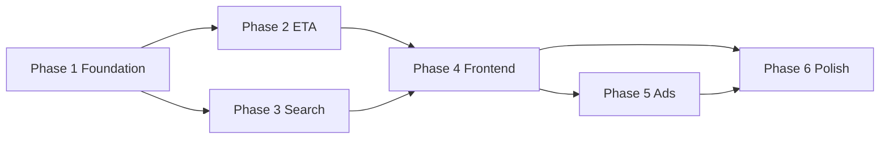

# Implementation Phases

Six-phase build plan for PT Dashboard. Each phase produces a testable increment.

## Phase 1 — Reactive Foundation

**Goal:** Runnable Quarkus app with Firebase auth and favorites CRUD.

| Task | Details |
|------|---------|
| Scaffold project | Quarkus 3, Hibernate Reactive, reactive-pg-client, Flyway, quarkus-security, firebase-admin, Caffeine, REST Client Reactive, Web Bundler |
| Docker Compose | PostgreSQL on port 5432 |
| Firebase setup | Create project, enable Email/Password, service account JSON, web app config |
| `FirebaseAuthFilter` | Verify ID tokens on worker pool; set `SecurityIdentity` |
| Flyway `V1__init.sql` | `users` (`firebase_uid` unique, no password), `favorites` tables |
| Auth API | `POST /auth/sync`, `GET /auth/me` |
| Favorites CRUD | Reactive Panache entities; route-required validation for bus/GMB |
| Dev seed | `V2__dev_seed.sql` (dev profile): sample favorites linked to test Firebase uid |

**Exit criteria:** Firebase sign-in (manual/console), sync user, create/list/delete favorites via REST; all handlers return `Uni`.

---

## Phase 2 — Reactive ETA Proxy

**Goal:** Live ETAs for saved favorites.

| Task | Details |
|------|---------|
| REST clients | `KmbClient`, `CitybusClient`, `NlbClient`, `GmbClient`, `MtrClient` — all reactive |
| `EtaNormalizer` | Per-operator mapping to normalized `EtaEntry` list |
| `GET /eta/favorites` | `Uni.combine().all()` parallel fetch; Caffeine cache keyed by `(type, stopId, route)` |
| `GET /eta/preview` | Single favorite preview before save |
| Unit tests | Recorded JSON fixtures for each normalizer |

**Exit criteria:** `GET /eta/favorites` returns normalized ETAs for KMB, CTB, GMB, and MTR test favorites.

---

## Phase 3 — Search & Add Flow

**Goal:** Discover stops and routes when adding favorites.

| Task | Details |
|------|---------|
| Static data ingestion | Startup or daily scheduled refresh of stop/route lists into cache |
| `GET /search/stops` | Name search across operators |
| `GET /search/routes-at-stop` | **Mandatory route picker data** for bus/GMB |
| `GET /search/routes` | Route number search (alternative flow) |
| `GET /meta/mtr/lines` | MTR line + station metadata |

**Exit criteria:** Can discover a stop, list its routes, preview ETA, and save as favorite entirely via API.

---

## Phase 4 — Frontend

**Goal:** Usable web UI.

| Task | Details |
|------|---------|
| Auth pages | Firebase login/register/Google; `onAuthStateChanged` guards; `POST /auth/sync` on sign-in |
| Dashboard | Per-route bus/GMB cards, MTR cards, auto-refresh (60s) |
| Add-favorite wizard | Type → stop → **required route** → preview → save |
| Settings | Account info, logout |
| Stretch | Drag-to-reorder favorites |

**Exit criteria:** End-to-end user flow in browser — Firebase sign-in, sync user, add favorites, view live ETAs.

---

## Phase 5 — Advertisement Injection

**Goal:** Monetizable ad slots on the dashboard.

| Task | Details |
|------|---------|
| `ad_slots` table | Flyway `V3__dev_ads.sql` with placeholder ads |
| `GET /ads/active` | Filter by placement, date range, priority |
| `POST /ads/{id}/impression` | Fire-and-forget counter, IP rate-limited |
| Admin API | CRUD at `/admin/ads` (Firebase custom claim `admin: true`) |
| `AdBanner` component | Intersection Observer impression tracking |
| Placements | `dashboard_top`, `dashboard_inline` (every 3 cards), `dashboard_bottom` |
| Dev assets | Placeholder images in `META-INF/resources/ads/` |

**Exit criteria:** Dashboard shows ads; impressions increment; admin can create/edit ads.

See [Advertisements](ads.md) for full spec.

---

## Phase 6 — Polish

**Goal:** Production readiness.

| Task | Details |
|------|---------|
| Bilingual | EN + zh-Hant; pass `lang` to upstream APIs |
| Error states | Stale badges, upstream error messages, empty states |
| Health checks | `/q/health` — DB + upstream reachability |
| README | Final local dev instructions |
| Documentation | Keep `docs/` in sync with implementation |

**Exit criteria:** App handles failures gracefully; health endpoint green in dev; README accurate.

---

## Dependency graph



Phases 2 and 3 can run in parallel after Phase 1. Frontend (Phase 4) requires both ETA and search APIs.

## Risks

| Risk | Phase | Mitigation |
|------|-------|------------|
| MTR/batch 429 rate limits | 2 | Server-side Caffeine cache; deduplicate per-route keys |
| Per-route favorites increase API volume | 2 | Shared cache across users |
| Hibernate Reactive + Flyway | 1 | JDBC for migrations only; reactive-pg-client at runtime |
| Large stop lists slow search | 3 | Prefix index; 24h cache; no full scan per keystroke |
| NLB POST JSON differs from GET operators | 2 | Dedicated `NlbClient` |
| Ad impression abuse | 5 | IP rate limiting; fire-and-forget writes |
| Red minibus user expectation | 4 | UI copy: green minibus only |

## Scaffold command

```bash
quarkus create app com.faworkshop.ptdashboard:pt-dashboard:1.0.0-SNAPSHOT \
  --extension=rest-jackson,hibernate-reactive-panache,reactive-pg-client,flyway,security,caffeine,rest-client-reactive-jackson
# Add manually: com.google.firebase:firebase-admin
quarkus ext add io.quarkiverse.web-bundler:quarkus-web-bundler
```
