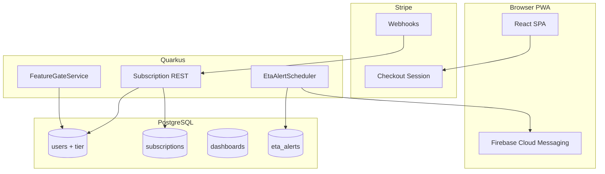

# Monetization — Pro Tier

PT Dashboard uses a **freemium** model. The free tier is ad-supported with usage limits; **Pro** unlocks premium commute features for **HK$18/month**.

## Tiers

| Feature | Free | Pro (HK$18/mo) |
|---------|------|----------------|
| Favorites | Up to **5** | **Unlimited** |
| Dashboard refresh | 60s | **30s** (bus/GMB); MTR cache **10s** |
| Advertisements | Shown | **Ad-free** |
| ETA push alerts | — | **Yes** — notify when arrival ≤ N minutes |
| Named dashboards | 1 (default) | **Multiple** (e.g. Home, Work) |
| PWA / home screen | Basic | **Full** install prompt + app icon |

Price: **HK$18/month**, billed monthly. Annual plan (e.g. HK$168/yr) is a future option.

## Architecture

## Data model extensions

### `users` (add columns)

| Column | Type | Notes |
|--------|------|-------|
| `tier` | ENUM | `FREE` (default) \| `PRO` |
| `tier_expires_at` | TIMESTAMPTZ | Null for free; set on active Pro subscription |

### `subscriptions`

| Column | Type | Notes |
|--------|------|-------|
| `id` | UUID | PK |
| `user_id` | UUID | FK → users |
| `stripe_customer_id` | VARCHAR | Stripe customer |
| `stripe_subscription_id` | VARCHAR | Unique |
| `status` | ENUM | `ACTIVE`, `PAST_DUE`, `CANCELED`, `EXPIRED` |
| `current_period_end` | TIMESTAMPTZ | Drives `tier_expires_at` on user |
| `created_at` | TIMESTAMPTZ | |

### `dashboards` (Pro: multiple named boards)

| Column | Type | Notes |
|--------|------|-------|
| `id` | UUID | PK |
| `user_id` | UUID | FK |
| `name` | VARCHAR | e.g. "Home", "Work" |
| `sort_order` | INT | |
| `is_default` | BOOLEAN | Free users have one default only |

Favorites gain optional `dashboard_id` FK (default dashboard if null).

### `eta_alerts` (Pro: push notifications)

| Column | Type | Notes |
|--------|------|-------|
| `id` | UUID | PK |
| `user_id` | UUID | FK |
| `favorite_id` | UUID | FK → favorites |
| `threshold_minutes` | INT | Fire when ETA ≤ this value (e.g. 5) |
| `fcm_token` | VARCHAR | Device token |
| `last_sent_at` | TIMESTAMPTZ | Debounce repeat alerts |
| `enabled` | BOOLEAN | |

## Feature gating (`FeatureGateService`)

Server-side enforcement — never rely on UI alone.

| Check | Free | Pro |
|-------|------|-----|
| `POST /favorites` | Reject if count ≥ 5 | No limit |
| `GET /ads/active` | Return ads | Return **empty list** |
| `POST /dashboards` | Reject if count ≥ 1 | Allow multiple |
| `POST /eta/alerts` | `403 PRO_REQUIRED` | Allow |
| ETA refresh interval hint | `refreshAfter: 60` | `refreshAfter: 30` |

`GET /auth/me` returns `{ tier, tierExpiresAt, features: { ... } }` for client UI.

## Payments — Stripe

| Item | Detail |
|------|--------|
| Provider | [Stripe](https://stripe.com) (HKD support) |
| Product | `PT Dashboard Pro` — HK$18/month recurring |
| Flow | `POST /subscription/checkout` → Stripe Checkout → redirect back |
| Webhooks | `checkout.session.completed`, `customer.subscription.updated`, `customer.subscription.deleted` |
| Cancel | `POST /subscription/cancel` or Stripe Customer Portal |

Webhook handler updates `subscriptions` and sets `users.tier` / `tier_expires_at`.

**Dev:** Stripe test mode + CLI webhook forwarding.

## Push alerts (Pro)

1. User enables alert on a favorite (threshold minutes)
2. Client registers FCM token via `POST /eta/alerts` with `favoriteId`, `thresholdMinutes`, `fcmToken`
3. Background job (`EtaAlertScheduler`) polls ETAs for favorites with active alerts (respect upstream cache TTLs)
4. When `etaMinutes ≤ threshold` and debounce elapsed → send FCM notification
5. Notification: *"720 arriving in 5 min @ Admiralty"*

Uses **Firebase Cloud Messaging** (already on Firebase stack).

## API endpoints

| Method | Path | Auth | Tier |
|--------|------|------|------|
| `GET` | `/subscription/me` | Firebase | Any — returns tier + subscription status |
| `POST` | `/subscription/checkout` | Firebase | Free — creates Stripe Checkout session |
| `POST` | `/subscription/portal` | Firebase | Pro — Stripe Customer Portal URL |
| `POST` | `/subscription/webhook` | Stripe signature | Public — no Firebase |
| `GET` | `/dashboards` | Firebase | Any (free: max 1) |
| `POST` | `/dashboards` | Firebase | Pro for >1 |
| `POST` | `/eta/alerts` | Firebase | Pro |
| `DELETE` | `/eta/alerts/{id}` | Firebase | Pro |

## Frontend

| Screen | Purpose |
|--------|---------|
| `/upgrade` | Pro feature comparison, HK$18/mo CTA → Stripe Checkout |
| `/settings/subscription` | Current plan, renew/cancel via Stripe Portal |
| Favorite card | "Alert me" toggle (Pro badge if free) |
| Settings | Manage dashboards (Pro), notification permission |

Free users see a subtle upgrade prompt when hitting the 5-favorite limit or viewing ads.

## Relationship to ads (Phase 5)

Ads and Pro are complementary revenue streams:

- **Free users** see ads → ad revenue
- **Pro users** pay HK$18/mo → subscription revenue, no ads

`GET /ads/active` checks tier server-side; Pro users never receive ad payloads.

## Risks

| Risk | Mitigation |
|------|------------|
| Stripe webhook missed | Reconcile job: daily sync subscription status from Stripe API |
| FCM alert spam | Debounce `last_sent_at`; one alert per favorite per trip window |
| Tier bypass | All limits enforced in `FeatureGateService` on backend |
| Refund/chargeback | Stripe handles; downgrade tier on `subscription.deleted` webhook |
